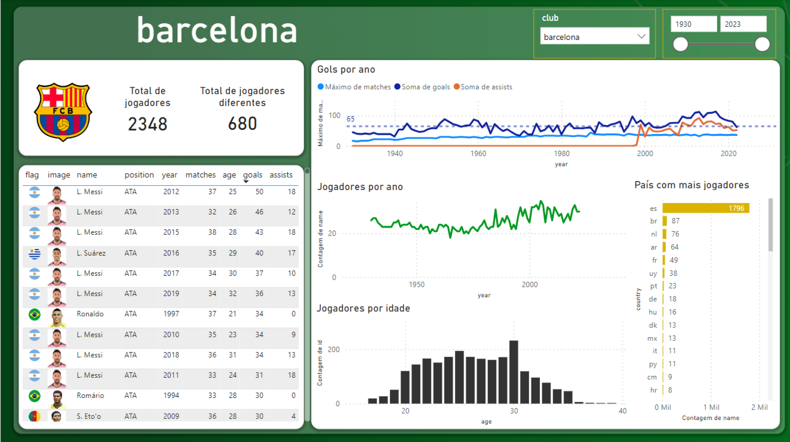
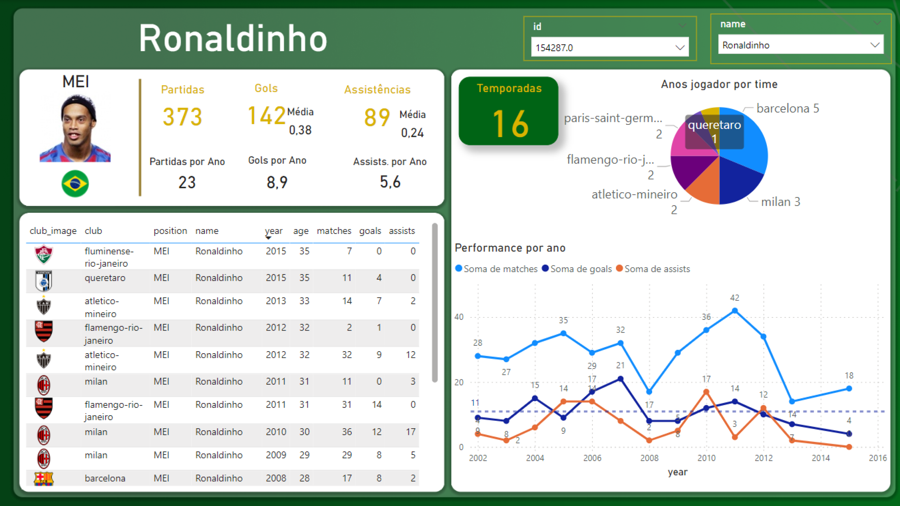
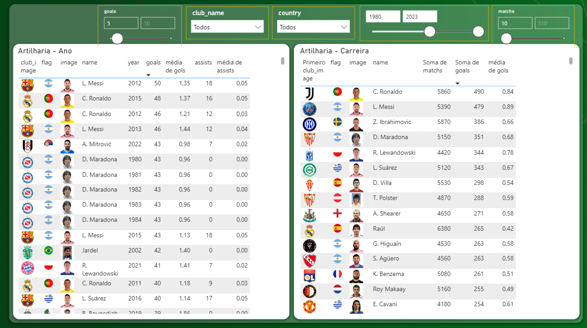
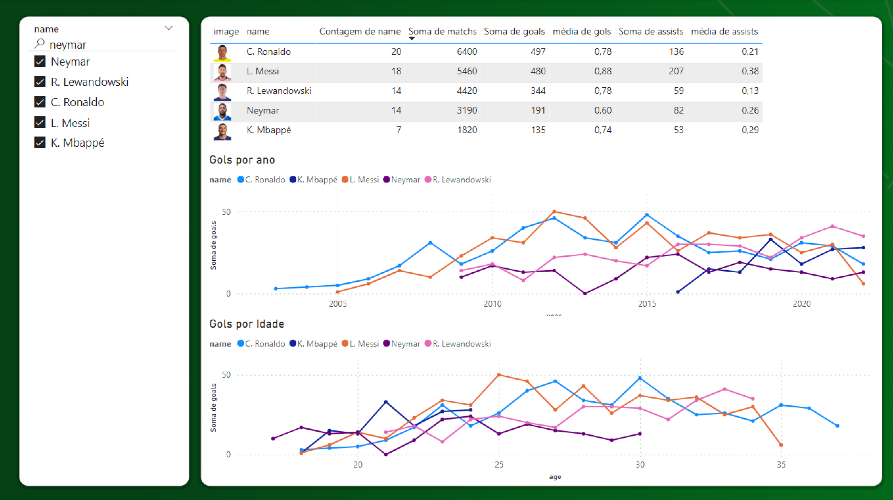
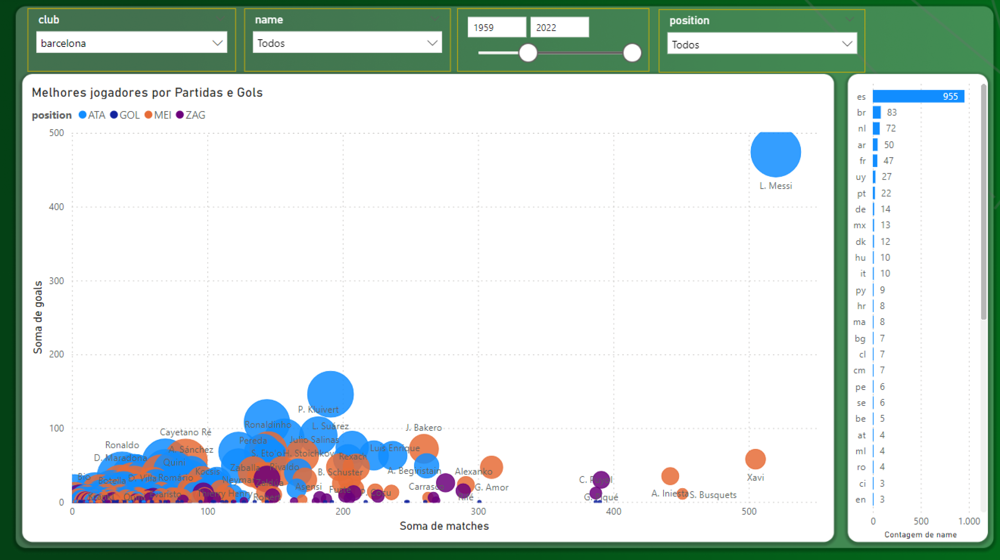
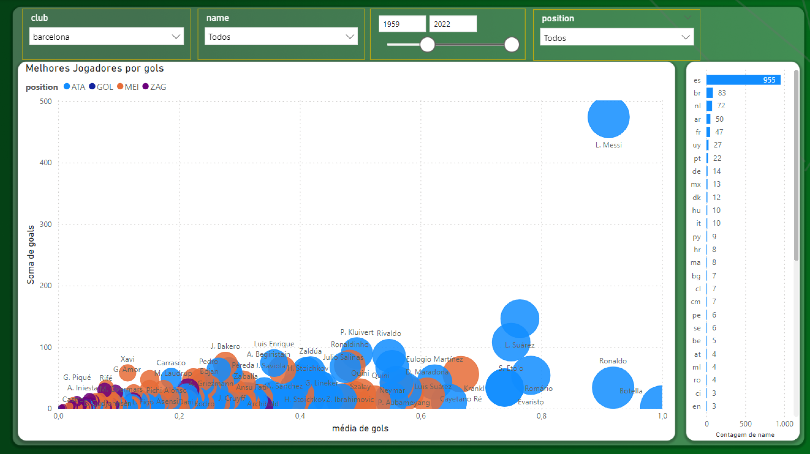
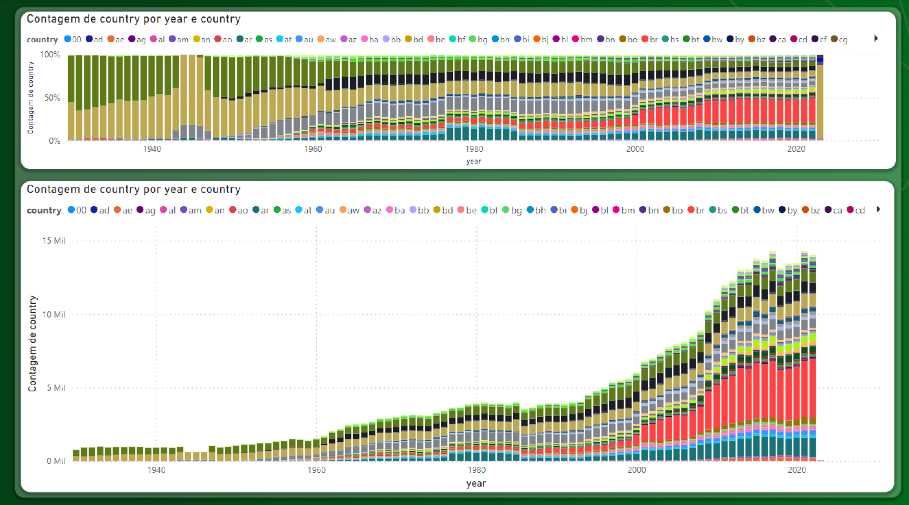

# All Football Players in History Database

This project involves generating a comprehensive database containing information about football players throughout history. Nowadays the website changed, so the current code can only get the most recent data from the website. The database is created by web scraping using Python's Beautiful Soup library.

# Project Overview

## Objective

The primary goal of this project is to compile an extensive database encompassing information about football players, including their personal details, career statistics, clubs played for, goals, assists, and more. The data is collected by scraping besoccer.com football-related website to create a comprehensive repository.

## How to run

Download the files and run `main.py`

# Tools and Technologies

**Python:** Programming language used for web scraping and data processing.

**Beautiful Soup:** Python library for parsing HTML and XML documents to extract information.

**Power BI:** Dashboard to analyze data from this extensive dataset.

# Steps Involved

**Web Scraping:** Use Beautiful Soup to extract player information from football-related websites, including player profiles, career stats, personal details, and more.

**Data Processing:** Clean, preprocess, and organize the extracted data to create a structured dataset.

**Database Creation:** Store the collected player data in a database for easy retrieval and analysis.

# Data Visualization with Power BI

Team Analysis

Player Analysis

Top Goal Scorers

Players Comparison

Players Performance

Overall Dataset Analysis by player country throught the years

# Author

Marcos Paulo Dal Maso